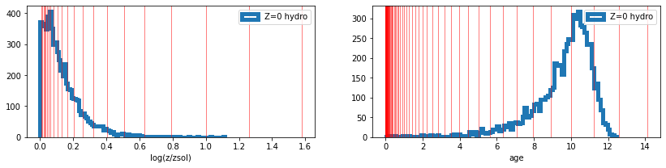

# hydro_colors

<!-- WARNING: THIS FILE WAS AUTOGENERATED! DO NOT EDIT! -->

## Installation

``` sh
pip install hydro_colors
```

## Simple implementation to HACC hydro data

``` python
### First we import the following modules of hydro_colors
```

``` python
import hydro_colors as hc
from hydro_colors.load_sim_stellar_catalog import load_hacc_galaxy_data
from hydro_colors.calculate_csp import calc_fluxes_for_galaxy
from hydro_colors.load_sps_library import STELLAR_LIBRARY_DIR
```

``` python
galaxy_tags, _, _, _, _, _, _, _ = hc.load_sim_stellar_catalog.load_hacc_galaxy_data()
```

``` python
galaxy_number = 1
unique_galaxy_tag = np.unique(galaxy_tags)[galaxy_number]

spec_wave_ssp, spec_flux_ssp, spec_csp, flux_proxy, gal_stellar_mass = hc.calculate_csp.calc_fluxes_for_galaxy('../hydro_colors/data/test_hacc_stellar_catalog/Gals_Z0.txt',
                       unique_galaxy_tag,
                       STELLAR_LIBRARY_DIR)
```

    Library shape:  (22, 94, 1963)
    Wavelength shape:  (1963,)

``` python
plt.figure()
plt.plot(spec_wave_ssp, spec_flux_ssp.T)
plt.plot(spec_wave_ssp, spec_csp)
plt.xscale('log')
plt.yscale('log')
plt.xlim(1e2, 1e3)
```

    (100.0, 1000.0)



## Under the hood

``` python
# ssp_interpolation import *
from hydro_colors.load_ssp_library import *
from hydro_colors.load_sim_stellar_catalog import *
```

``` python
spec_flux, spec_wave = load_fsps_spectral_library()
age_fsps_gyr, Z_padova_fsps = load_fsps_age_metallicity()
gal_tag, stellar_idx, metal_hydro, mass, age_hydro, x, y, z = load_hacc_galaxy_data()


f, a = plt.subplots(1,2, figsize=(14, 3))
a[0].hist(metal_hydro, bins = 100, histtype='step', lw=5, label='Z=0 hydro');
[a[0].axvline(_x, linewidth=1, color='r', alpha=0.5) for _x in Z_padova_fsps];
a[0].legend()
a[0].set_xlabel('log(z/zsol)')


a[1].hist(age_hydro, bins = 100, histtype='step', lw=5, label='Z=0 hydro');
[a[1].axvline(_x, linewidth=1, color='r', alpha=0.5) for _x in age_fsps_gyr];
a[1].legend()
a[1].set_xlabel('age')

plt.show()
```

    Library shape:  (22, 94, 1963)
    Wavelength shape:  (1963,)


